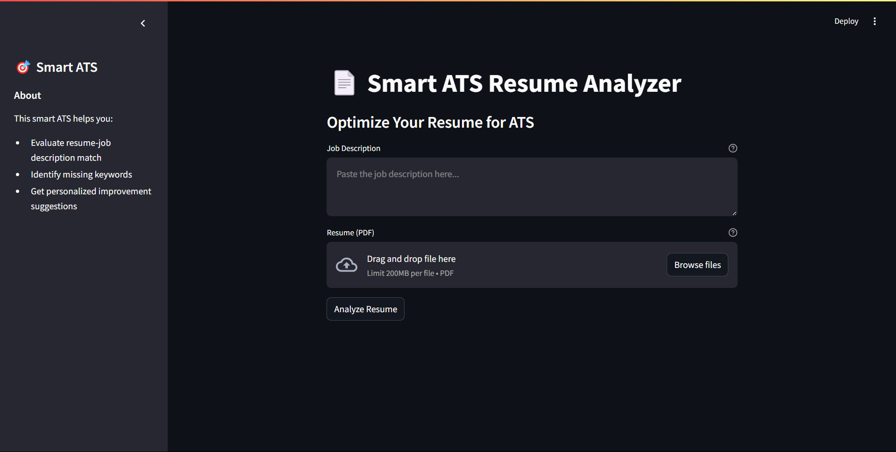

# Smart ATS Resume Analyzer

## Overview
Smart ATS Resume Analyzer is a Streamlit-based web application that evaluates the match between a resume and a job description (JD). It utilizes Google Gemini AI to analyze the resume content, identify missing keywords, and provide suggestions for improvement.

## Features
- Upload a resume in PDF format
- Paste a job description for comparison
- Receive a match score (0-100%)
- Identify missing keywords
- Get a profile summary with improvement suggestions

## Technologies Used
- **Python**
- **Streamlit**
- **Google Generative AI (Gemini API)**
- **PyPDF2** (for PDF text extraction)
- **FastAPI & Uvicorn** (backend support)

## Installation & Setup
### Prerequisites
Ensure you have Python (>=3.8) installed on your system.

### Step 1: Clone the Repository
```bash
git clone <your-repository-url>
cd smart-ats-resume-analyzer
```

### Step 2: Create a Virtual Environment (Optional but Recommended)
```bash
python -m venv venv
source venv/bin/activate  # On Windows: venv\Scripts\activate
```

### Step 3: Install Dependencies
```bash
pip install -r requirements.txt
```

### Step 4: Set Up Environment Variables
Create a `.env` file in the project directory and add your Google API Key:
```env
GOOGLE_API_KEY=your_google_api_key_here
```

### Step 5: Run the Application
```bash
streamlit run app.py
```

## Usage
1. Open the app in your browser (usually http://localhost:8501/)
2. Paste the job description in the provided text area
3. Upload your resume in PDF format
4. Click the "Analyze Resume" button
5. View the match score, missing keywords, and profile summary

## Screenshot


## Contributing
Feel free to fork this repository and submit pull requests for improvements!

## License
This project is licensed under the MIT License.

---

### Notes:
- If you face any issues with dependencies, ensure your virtual environment is activated before running the app.
- Make sure your Google API key is valid and has access to the Gemini AI model.
- The `.env` file should not be shared publicly to keep API keys secure.

---

Enjoy optimizing your resume with Smart ATS!

